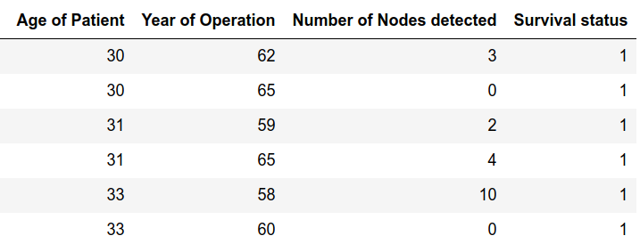

# kNN Implementation using only Python

## Data Set Information:

The dataset contains cases from a study that was conducted between 1958 and 1970 at the University of Chicago's Billings Hospital on the survival of patients who had undergone surgery for breast cancer.

## Attribute Information:

- **Index 1**. Age of patient at time of operation (numerical)  
- **Index 2**. Patient's year of operation (year - 1900, numerical)   
- **Index 3**. Number of positive axillary nodes detected (numerical)  
- **Index 4**. Survival status (Label attribute)  
    - Label 1 = the patient survived 5 years or longer 
    - Label 2 = the patient died within 5 year

## Distance Metric

In this example we use the [**Euclidean Distance**](https://en.wikipedia.org/wiki/Euclidean_distance).

## Additional Information

### Total
- Number of samples: 306
- Number of Samples of Label 1: 225
- Number of Samples of Label 2: 81
- Proportion of the dataset to include in the train split: *60%* (0.6)

### Train Samples
- Number of samples: 183
- Number of Samples of Label 1: 132
- Number of Samples of Label 2: 51

### Test Samples
- Number of samples: 123
- Number of Samples of Label 1: 93
- Number of Samples of Label 2: 30

## Results
- Total of hits: 93
- Success Rate (%): **75.61%**